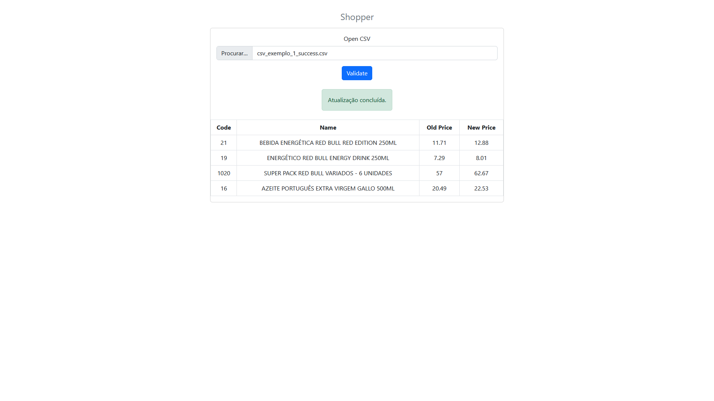
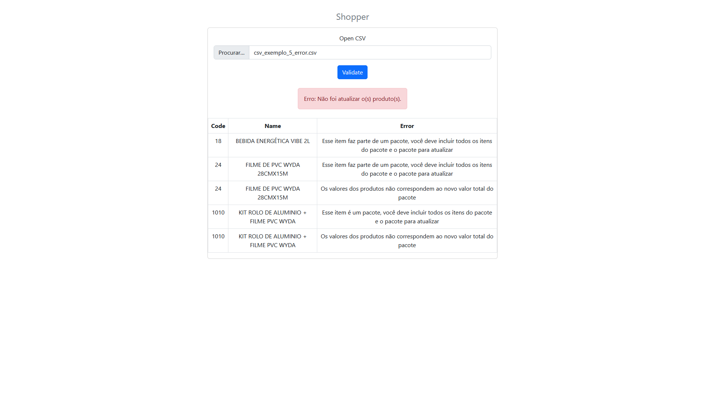

# shopper

Projeto desenvolvido para a vaga de Desenvolvedor Jr. na Shopper.com.br

- [Necessária a instalação do Yarn](https://classic.yarnpkg.com/lang/en/docs/install/#windows-stable)

* Projeto dividido em duas partes:
	* [backend](#backend)
	* [frontend](#frontend)

- O diretório [.ss](/.ss) contém imagens/prints da tela web (frontend).

 

## [backend](/backend)

- Desenvolvido usando Node.js
- Aplicação funcionando no endereço: http://localhost:8080/shopper/ws
- Atualização feita através do endereço: http://localhost:8080/shopper/ws/product utilizando o método PUT.

Aplicação servidora.

As configurações de conexão com o banco de dados estão no arquivo: [backend/config/.env](/backend/config/.env)

Script do banco de dados MySQL: **[shopper_database.sql](shopper_database.sql)**

- Para instalar as dependências (*node_modules*), utilizar o comando: **yarn install**
- Para dar start/início à aplicação, utilizar o comando: **yarn start**

 

## [frontend](/frontend)

- Desenvolvido usando ReactJS

Cliente WEB.

- O diretório [.csv](/.csv) contém arquivos '.csv' de exemplo para serem carregados pela aplicação web.

- Para instalar as dependências (*node_modules*), utilizar o comando: **yarn install**
- Para dar start/início à aplicação, utilizar o comando: **yarn start**

